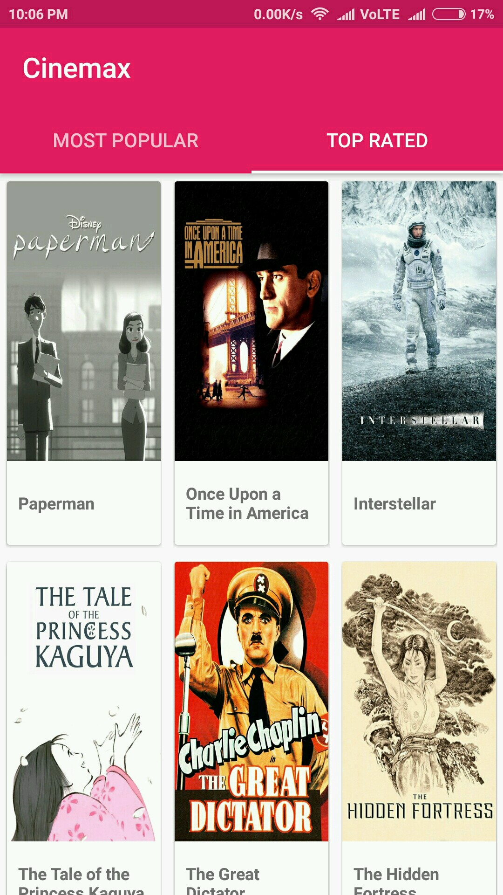
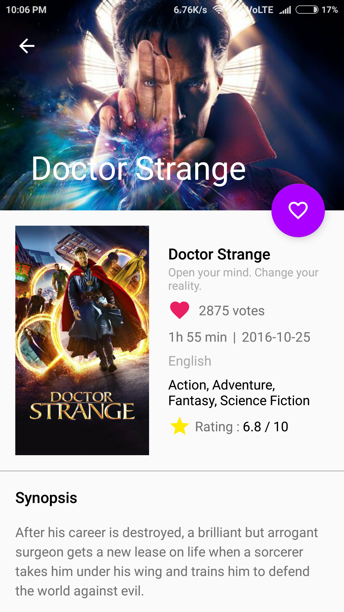
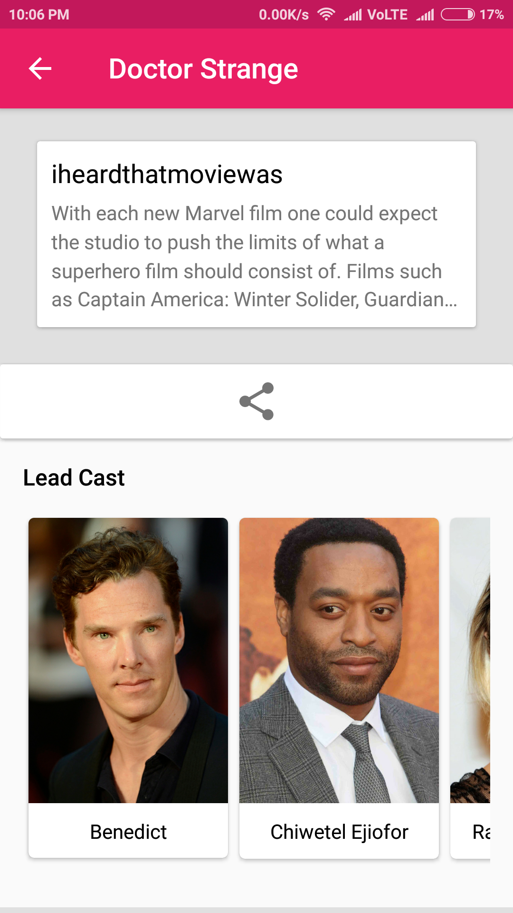
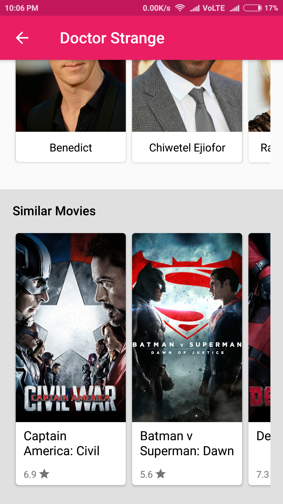

# Cinebuff - A movie application
Cinebuff is an Android application that displays movies information and trailers.

## Configuration
Place your API key API_KEY variable in TmdbUrl.java file.

## Screenshots

